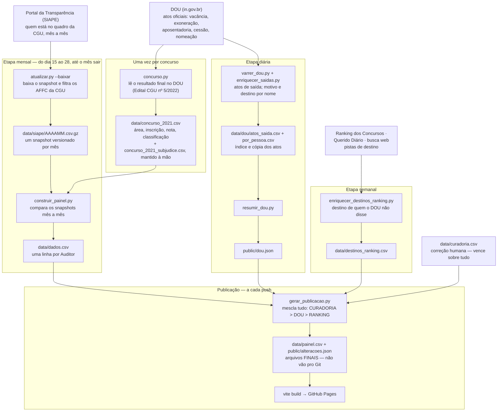

# observatoriocgu.github.io

Observatório das Evasões — CGU.

Site estático (GitHub Pages) que monitora a evasão de Auditores Federais de
Finanças e Controle (AFFC) da CGU — quem saiu, quando, por quê e para onde —
a partir da homologação do concurso CGU-2021 em 14/06/2022.

Fork do Observatório SEF-MG (Auditores Fiscais da Receita Estadual de Minas Gerais).

Acesse em **<https://observatoriocgu.github.io/>** — o painel fica em
[/evasao/](https://observatoriocgu.github.io/evasao/).

## Fluxo dos dados

A ideia em uma frase: o **SIAPE** diz *quem* saiu e *quando*; o **DOU** diz
*por quê* e *para onde*; ranking, diários municipais e busca web completam o
destino quando o DOU não diz; a **curadoria humana** corrige tudo; e o site
nunca monta dado — só lê os arquivos finais gerados na publicação.

Etapa por etapa (caminhos relativos a `evasao/`; scripts em `evasao/scripts/`):

- **Fontes externas** — Portal da Transparência (quem está no quadro), DOU
  (os atos oficiais), e Ranking dos Concursos / Querido Diário / busca web
  (pistas de para onde a pessoa foi). `data/curadoria.csv` é a correção
  humana, que vence sobre todas.
- **Uma vez por concurso** (`atualizar.py --concurso`) — `concurso.py` lê o
  resultado final no DOU (Edital CGU nº 5, de 13/06/2022) e grava
  `data/concurso_2021.csv` (área, inscrição, nota, classificação, modalidade),
  mesclando `data/concurso_2021_subjudice.csv`, que é mantido **à mão**. É de
  lá que `construir_painel.py` tira CONCURSO e AREA de cada Auditor. Quando
  houver outro concurso, é aqui que ele entra.
- **Etapa mensal** (`atualizar-siape.yml`, local ou CI — o Portal publica sem
  dia fixo, então o CI tenta do dia 15 ao 28: um `--dry-run` pergunta em
  segundos se o mês saiu e, sem mês novo, o job termina ali) —
  `atualizar.py --baixar` orquestra: baixa o snapshot do mês do Portal
  (`baixar_transparencia.py`), reduz aos AFFC lotados na CGU
  (`filtrar_affc.py`), versiona em `data/siape/AAAAMM.csv.gz` e
  `construir_painel.py` compara a série inteira para gerar `data/dados.csv`
  e `data/serie_mensal.csv`. "Saiu" = sumiu do quadro a partir da última
  presença.
- **Etapa diária** (`atualizar-saidas-dou.yml`) — `varrer_dou.py` varre o
  DOU do dia por frase e registra os atos de saída em
  `data/dou/atos_saida.csv` (com cópia do texto); `enriquecer_saidas.py`
  busca por nome o motivo e o destino de cada saída
  (`data/dou/por_pessoa.csv`); `resumir_dou.py` gera o resumo
  `public/dou.json` para o site.
- **Etapa semanal** (`atualizar-destinos-ranking.yml`) —
  `enriquecer_destinos_ranking.py` procura o destino de quem saiu sem que o
  DOU dissesse para onde: Ranking dos Concursos → diário municipal
  (`diarios.py`) → busca web (`buscaweb.py`) → `data/destinos_ranking.csv`.
- **Publicação** (`deploy-pages.yml`, a cada push e ao fim do workflow do
  DOU) — `gerar_publicacao.py` (via `prebuild` do npm) mescla o que está no
  Git — `dados.csv` + `public/dou.json` + `destinos_ranking.csv` + curadoria
  — e escreve os arquivos finais que o site lê: `data/painel.csv` e
  `public/alteracoes.json`. Eles não vão pro Git: nascem na publicação,
  sempre frescos. `vite build` monta o site (React) e o GitHub Pages publica.

O detalhe (regras de dados, decisões e histórico) mora no
[CLAUDE.md](CLAUDE.md) e no [PLANO.md](PLANO.md).
